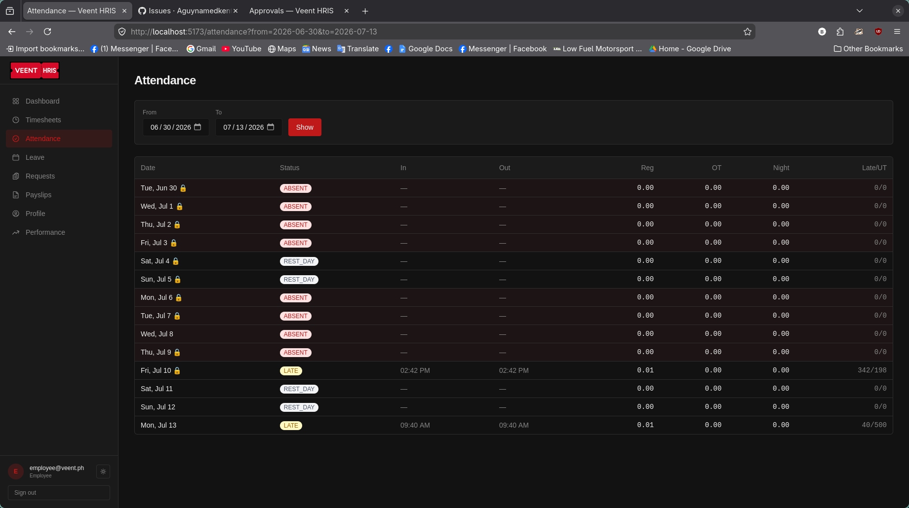

**VEENT HRIS**   
**HR/Admin User**

1. **Dashboard**

Purpose: HR Home Page

*\*When logged in, the Dashboard gives an overview of:*

* Employee headcount  
* Employees currently on leave  
* Attendance summary  
* Pending approvals  
* Payroll status  
* Recent announcements  
* Notifications  
    
2. **Employee Module (Digital 201 Files)**

*\*This is where to maintain every employee’s master record.*   
*Typical information includes:*

* Personal information  
* Employment details  
* Department  
* Position  
* Salary  
* Employment status  
* Government number (SSS, PhilHealth, Pag-IBIG, TIN)  
* Emergency contacts  
* Bank account  
* Uploaded documents

***\*For Typical HR Tasks***

New Employee

* Create employee profile  
* Assign employee ID  
* Set work schedule  
* Set salary  
* Assign department  
* Upload employment contract

Existing Employee

* Update promotions  
* Salary adjustments  
* Transfer departments  
* Change employment status

*\*This becomes the employee’s digital 201 File, replacing paper folders*

3. **Attendance / Timesheets**

*\*This module receives attendance data from a \[software/app\]*

You’ll see:

* Time In  
* Time Out  
* Late minutes  
* Undertime  
* Overtime  
* Missing Logs  
* Break records

Daily HR workflow

Morning:

- Check who failed to time in

Afternoon:

- Verify incomplete logs  
- Investigate missing attendance

Payroll week:

- Correct attendance errors before payroll generation.

*\*Many companies complete attendance validation before locking payroll.*

4. **Request Module**

*\*Employees submit requests through the Employee Kiosk.*

Example includes:

* Leave  
* Overtime  
* Undertime  
* Official Business  
* Work on Rest Day  
* Holiday Work  
* Personal Information updates

*(For HR: review each request, verify supporting documents, and forward or approve them according to company policy.)*

5. **Approval Module**

Managers or HR approve employee requests.

Typical approval flow is:

Employee \> Supervisor \> HR \> Payroll

You can:

- Approve  
- Reject  
- Return for correction

*\*Approved requests automatically affect attendance and payroll where applicable.*

6. **Payroll Module**

This is the heart of the system. 

Typical payroll process:

1. Create payroll period  
2. Import attendance  
3. Review employee earnings  
4. Review deductions  
5. Verify overtime and holiday pay  
6. Generate payroll  
7. Lock payroll  
8. Release payslip

The system should automatically compute: 

* Basic salary  
* Overtime  
* Night diff (if configured)  
* Holiday pay  
* Rest day pay  
* Allowances  
*  Incentives  
* Cash advances  
* Loans  
* SSS  
* Philhealth  
* Pag-IBIG  
* Withholding tax

*\*Payroll can also support direct bank or GCash disbursement.*

**7\.  Payroll Calculator**   
*\*This module lets HR preview payroll computations before finalizing payroll.* 

Example:

* Compute overtime  
* Check holiday pay  
* Test salary adjustments  
* Review incentives  
* Verify deductions

*(It’s especially useful for validating unusual payroll cases before the payroll run).*

**8\.   Reports**  
HR should generate reports such as:

* Payroll register  
* Payslips  
* Attendance Reports  
* Tardiness Reports  
* Overtime Reports  
* Leave Reports  
* Loan Summary  
* Government Reports  
* BIR Reports

*\*These reports can be exported for Finance, Accounting, or audit purposes.*

9.  **Recruitment (HRIS)**

\*If the organization  uses the HRIS module, recruitment should be managed using the same platform.

Workflow:

- Create job posting  
- Publish to supported platforms  
- Receive applications  
- Screen applicants  
- Schedule interviews  
- Record interview notes  
- Issue job offers  
- Start onboarding

*\*This reduces the need to move between separate hiring tools.*

10.    **Employee Onboarding**

After hiring, HR can:

- Upload contracts  
- Assign departments  
- Create employee records  
- Generate company accounts  
- Register payroll details  
- Begin attendance tracking

 *(Because HRIS and Payroll are integrated, employee information can sync into payroll without manual re-entry.)*

11.   **Employee Separation**

When an employee resigns or is terminated, HR can manage:

- Resignation records  
- Clearance  
- Exit documents  
- Final pay processing  
- Employment status updates  
- Separation reports

*\*This helps keep employee records complete through the end of the employment.*

12.   **Users & User Rights**

This module controls who can access each part of the system:

For example:

| User | Typical Access |
| :---- | :---- |
| HR | Full HR and Payroll access |
| Payroll Officer | Payroll only |
| Department Manage | Team approvals |
| Employee | Self-service only |
| Finance | Payroll reports |

*\*Role-based permissions help limit access to sensitive payroll and HR information.* 

13.    **Settings**

This is where HR or system administrators configure:

* Company information  
* Departments  
* Positions  
* Salary structures  
* Work schedules  
* Holiday calendar  
* Payroll cutoffs  
* Leave types  
* Earnings and deduction codes  
* User roles

*\*These settings form the foundation for attendance tracking and payroll processing.*

